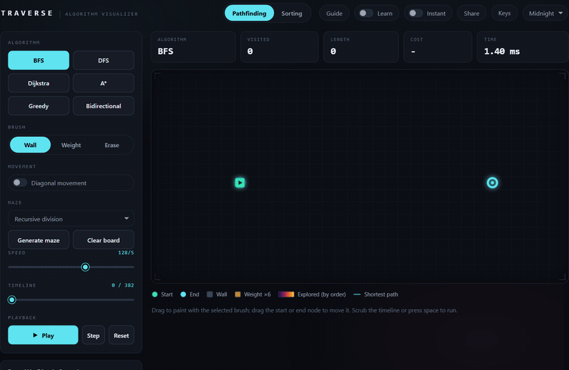

# Traverse

Traverse is an interactive visualizer for pathfinding and sorting algorithms. Pick an algorithm, watch it run step by step, scrub back and forth through its decisions, race two against each other, and follow short tutorials that explain what is happening as it happens.

Live demo: https://archie0099.github.io/Traverse/



## Features

- **Pathfinding:** BFS, DFS, Dijkstra, A\*, Greedy Best-First, and Bidirectional search on a grid you can paint with walls and weighted cells, with optional diagonal movement and four maze generators.
- **Sorting:** eleven algorithms (Bubble, Insertion, Selection, Merge, Quick, Heap, Shell, Cocktail, Comb, Gnome, Radix), plus a race mode that runs two on the same shuffle and reports which used fewer operations.
- **Guided learning:** a Learn toggle shows pseudocode that highlights in sync with the animation, with a plain-language note for each step, and five built-in tutorials.
- **Controls:** play, pause, single step, a scrubbable timeline, adjustable speed, an instant mode, full keyboard shortcuts, and optional sound for sorting.
- **Themes and sharing:** three color themes, and a Share button that encodes the whole board or array into the URL so a link reproduces exactly what you see.
- **Offline:** installable as a PWA and works offline after the first visit.

## Getting started

```bash
npm install
npm run dev
```

Then open http://localhost:5173. To make a production build, run `npm run build`, which type-checks the code and writes a static site to `dist/` that you can serve from any host. Everything runs in your browser; there is no backend.

## How it works

Traverse precomputes a run, then plays it back. Choosing an algorithm or editing the board runs it to completion and records every operation; a single animation loop then advances a cursor through that history at the chosen speed. Variable speed, pausing, single stepping, instant mode, and the scrubbable timeline all fall out of that one idea. Each algorithm is a small self-contained module that also carries its own pseudocode and per-line notes, which is what drives the learning mode.

The app is built with Vite and TypeScript. Rendering is plain Canvas 2D with no UI framework, so it stays smooth on large grids.

## Tests

```bash
npm test
```

The Vitest suite covers algorithm correctness and invariants (for example BFS, Dijkstra, and A\* agreeing on the shortest length, Bidirectional matching BFS, and every sort producing a sorted array across many sizes and inputs), the shareable-link codec, and a headless run that drives every control.

## License

MIT, see [LICENSE](LICENSE).
